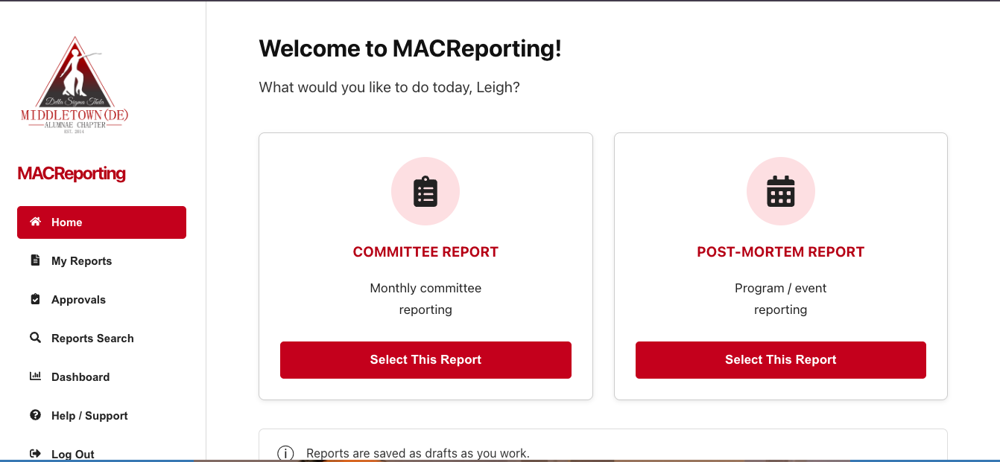
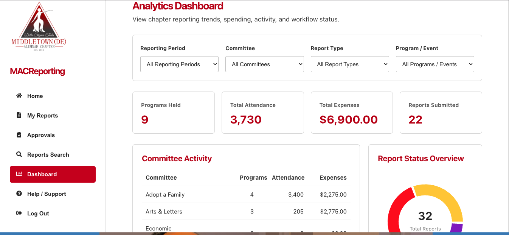
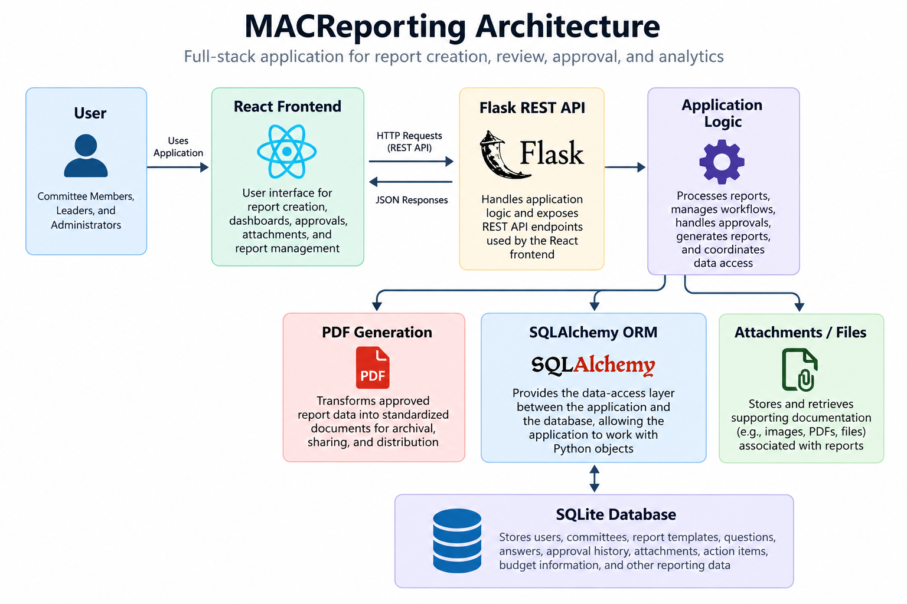
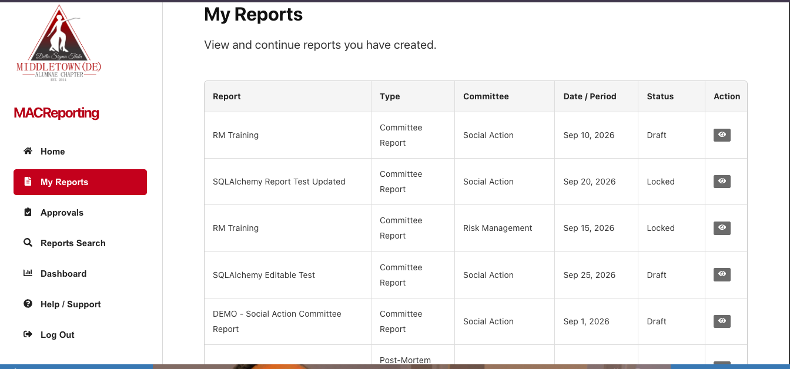
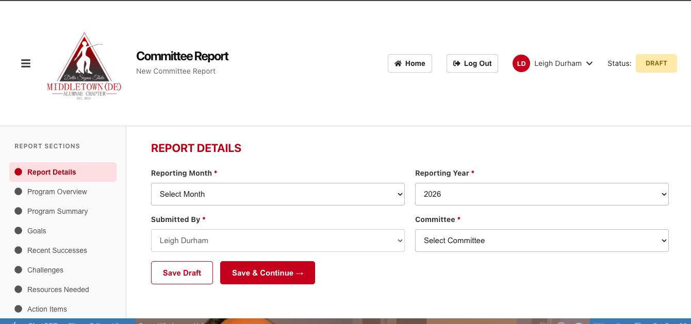
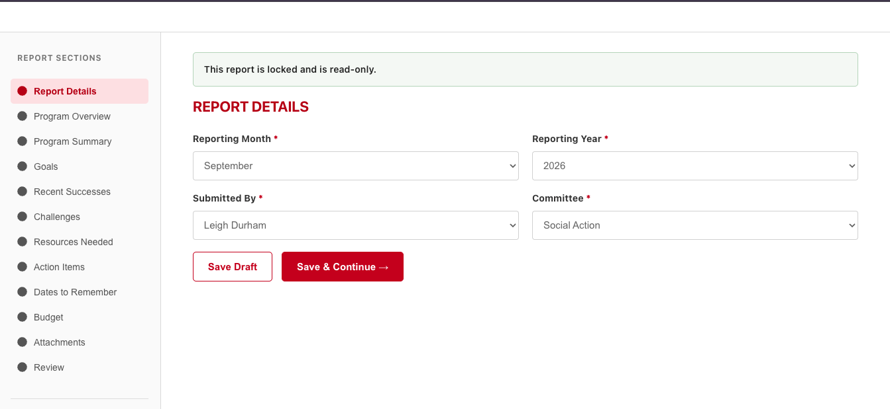
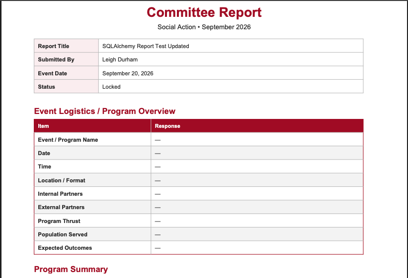

# MACReporting

### A Full-Stack Reporting & Analytics Application

MACReporting is a full-stack application I designed and developed to modernize the reporting process for a community-based organization.

The organization documents its work through monthly committee and post-event reports. While the existing process successfully collected information, retrieving and analyzing that information later required leadership to manually review hundreds of individual reports.

I built MACReporting to centralize that process — bringing report creation, approvals, historical records, and data visualization into one application.

  

> **Note:** The production source code is maintained in a private repository. This public repository serves as a portfolio case study highlighting the application's design, architecture, functionality, and development process.

## The Problem

The organization already had a process for collecting monthly committee and post-event reports. The challenge wasn't collecting the data — it was what happened afterward.

At the end of the year, leadership could be faced with reviewing hundreds of individual reports to locate accomplishments, attendance, financial information, program details, and other data needed for planning and award submissions.

Historical information was also difficult to retrieve and reuse, particularly as officers and committee leadership changed.

The reporting process needed more than another form. It needed a system that could preserve the organization's work and make that information useful.

## The Solution

I designed MACReporting as a centralized reporting application that manages the full lifecycle of a report — from initial entry through review, approval, and archival.

The application allows users to:

- Create structured monthly committee and post-event reports
- Save work and return to unfinished reports
- Submit reports through a defined review and approval workflow
- Preserve historical reports in a centralized database
- Generate standardized PDF reports for archival and distribution
- Upload and retain supporting documentation
- View dashboard metrics that turn individual reports into useful organizational insights

The result is a reporting process designed not only to collect information, but to make that information easier to find, analyze, and use.

### From Reporting to Insights

MACReporting goes beyond collecting reports. The analytics dashboard brings submitted data together so leadership can view program activity, attendance, expenses, reporting status, and committee performance without reviewing individual reports one at a time.

  

  <em>Interactive dashboard with reporting-period, committee, report-type, and program filters.</em>

## Application Architecture

MACReporting uses a full-stack architecture that separates the user interface, application logic, and data layer.

**React Frontend**  
Provides the user interface for report creation, dashboards, approvals, attachments, and report management.

**Python / Flask Backend**  
Handles application logic and exposes REST API endpoints used by the React frontend.

**SQLAlchemy ORM**  
Provides the data-access layer between the Flask application and the relational database, allowing application logic to work with Python objects rather than database-specific SQL throughout the codebase.

**SQLite Database**  
Stores users, committees, report templates, questions, answers, approval history, attachments, action items, budget information, and other reporting data.

**PDF Generation**  
Transforms approved report data into standardized documents that can be archived, shared, and referenced outside the application.

### Technology Stack

| Layer | Technology |
|---|---|
| Frontend | React, JavaScript, HTML, CSS |
| Backend | Python, Flask |
| API | REST |
| Data Access | SQLAlchemy |
| Database | SQLite |
| Version Control | Git, GitHub |

### Architecture Overview

  

## Key Features

### Role-Based Reporting

MACReporting provides users with access to the reports and functions appropriate to their responsibilities. Committee members can create and manage reports, while leadership can review submitted information and move reports through the approval process.

### Structured Report Creation

Reports use standardized templates and questions so information is collected consistently across committees and events. Users can save a report in progress and return later without losing their work.

### Review & Approval Workflow

Reports move through defined statuses from draft to submission, review, and approval. Once finalized, reports can be locked to preserve the approved record.

### Attachments & Supporting Documentation

Users can upload supporting files and documentation directly to a report, keeping related materials together rather than scattered across separate systems.

### PDF Generation & Archival

Completed reports can be transformed into standardized PDF documents for distribution, archival, and future reference.

### Reporting Dashboard

The dashboard turns individual report submissions into a broader view of organizational activity, helping leadership identify trends and retrieve information without manually reviewing reports one at a time.

## Application Workflow

### 1. Manage Reports

Users can view their reports in one place and quickly identify where each report is in its lifecycle, including drafts and finalized records.

  

### 2. Create & Save Reports

Structured, multi-section reports guide users through the information required by the organization. Reports can be saved as drafts and completed over time.

  

### 3. Preserve Finalized Records

Once a report completes the workflow, it can be locked and made read-only, protecting the finalized record from further changes.

  

### 4. Generate Standardized Reports

Report data can be transformed into a consistent PDF format for archival, distribution, and future reference.

  

## Engineering Highlights

MACReporting was designed around a real operational workflow rather than as a standalone coding exercise. Building it required translating reporting requirements into application behavior, data relationships, and business rules.

### Relational Data Model
Designed a relational data structure to support users, committees, roles, report templates, versioned questions, reports, answers, status history, attachments, action items, dates, and budget information.

### REST API
Built Flask REST endpoints to connect the React frontend with backend application logic and persistent data.

### SQLAlchemy Data Layer
Used SQLAlchemy to model database relationships and separate application logic from database-specific implementation.

### Workflow & Business Rules
Implemented report lifecycle controls including draft, submission, review, approval, locking, and read-only behavior to protect finalized records.

### Dynamic Report Structure
Designed reports around templates and questions rather than hard-coding a single form, providing a foundation for multiple report types and future changes to reporting requirements.

### File Management
Added attachment upload and retrieval while enforcing report-status rules that prevent modification of finalized records.

### PDF Generation
Developed standardized PDF output from stored report data, allowing approved information to be preserved and shared outside the application.

### Analytics & Visualization
Built an analytics dashboard that aggregates reporting data into metrics such as program activity, attendance, expenses, committee activity, and workflow status.

## Building on Experience

MACReporting gave me the opportunity to apply years of experience solving business and technology problems to a modern full-stack application.

My background includes enterprise systems, data analysis, Agile delivery, and translating business needs into technical solutions. For this project, I expanded that experience across React, Flask, REST APIs, SQLAlchemy, relational data modeling, and application development.

The biggest challenge wasn't simply writing the code. It was deciding how the system should work: how reports should move through the organization, how data should be structured for future use, what should happen when a report is finalized, and how collected information could become useful to leadership.

## Future Enhancements

The current application establishes the foundation for a broader reporting and analytics platform. Potential enhancements include:

- Expanded dashboard analytics and year-over-year comparisons
- Automated notifications for report submissions and approvals
- Additional administrative and role-management capabilities
- Configurable report templates and reporting periods
- Enhanced search and historical trend analysis
- Migration to a production-hosted database and deployment environment

---

### About This Repository

This repository is a public portfolio case study of MACReporting. The application source code and operational data are maintained privately.

The screenshots shown here use demonstration data and are intended to illustrate application functionality, architecture, and workflow.